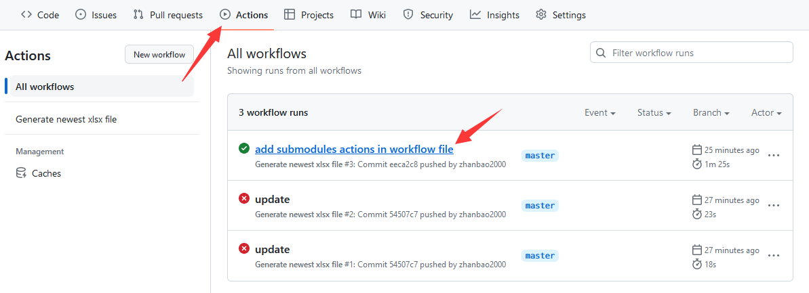
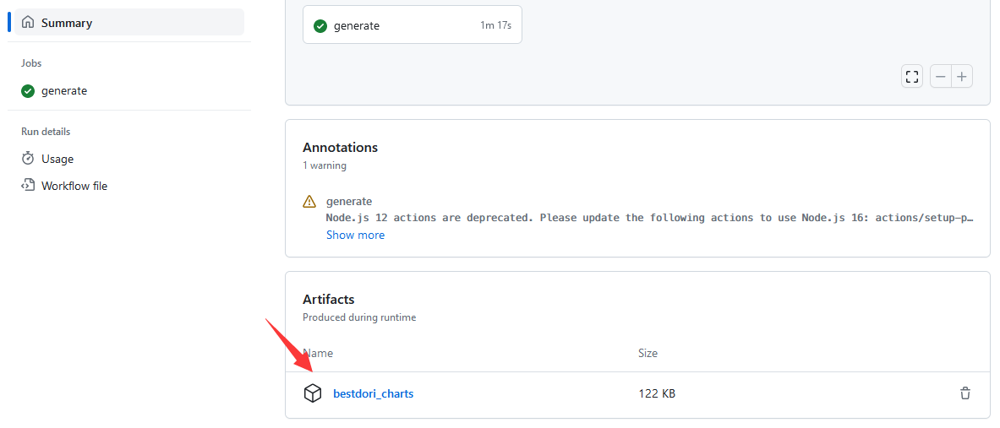
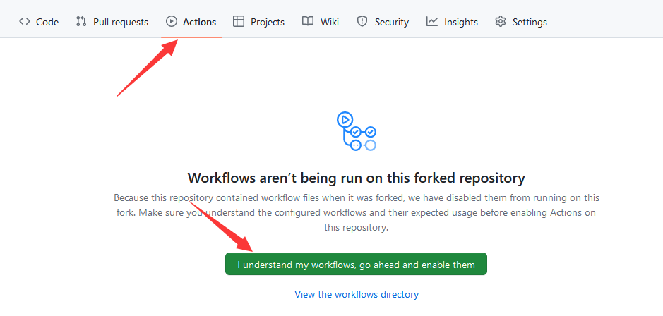
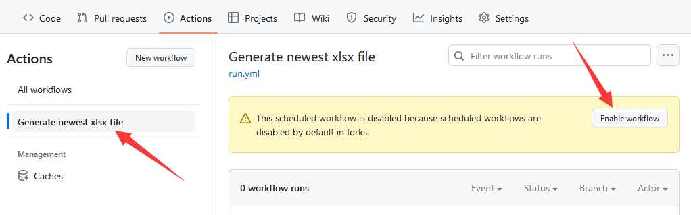
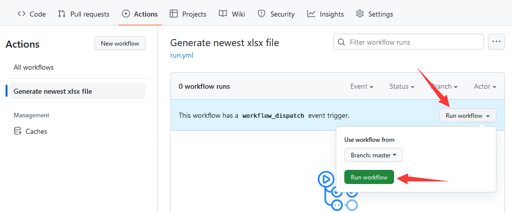

# 
邦邦谱面元数据自动导出脚本

Bandori Chart Metadata Excel Export Script

## 说明 Description

本仓库将会自动在每周日 UTC 0:00（北京时间 8:00）运行脚本，爬取 [bestdori.com](https://bestdori.com) 上的所有 EXPERT 和 SPECIAL 难度的谱面元数据，并导出为 Excel 文件。

Auto run script on every Sunday (UTC 0:00) to crawl all EXPERT and SPECIAL chart metadata on [bestdori.com](https://bestdori.com).

## 运行方式 Usage

你只需要登录 GitHub，然后进入该仓库的 [Actions](https://github.com/zhanbao2000/BandoriChartExcel/actions) 页面并点击最新的工作流，找到页面最下方的 `Artifacts` 并下载即可。

First, login GitHub, then go to [Actions](https://github.com/zhanbao2000/BandoriChartExcel/actions) page of this repo and click the latest workflow, find `Artifacts` at the bottom of the page and just download it.

## 工作流触发条件 Workflow Trigger

你可以查看 [`.github/workflows/run.yml`](.github/workflows/run.yml) 文件来查看工作流的触发条件。

You can check [`.github/workflows/run.yml`](.github/workflows/run.yml) to see the workflow triggers.

 - 当 `master` 分支有新的提交时（on new push to master）
 - 当 `master` 分支有新的 Pull Request 时（on new pull request to master）
 - 每周日 UTC 0:00（北京时间 8:00）（on every Sunday at UTC 0:00）
 - 手动触发（manual, see below）

## 手动触发说明 Manual Trigger

首先 fork 该仓库

Fork this repo first.

在你 fork 的仓库中点击 `Actions`，然后点击 `I understand my workflows, go ahead and enable them`。

Click `Actions` in your forked repo, then click `I understand my workflows, go ahead and enable them`.

点击左侧的 `Generate newest xlsx file`，然后点击 `Enable workflow`。

Click `Generate newest xlsx file` on the left, then click `Enable workflow`.

点击 `Run workflow` 即可。

Click `Run workflow` to run it.

当工作流运行结束后，即可在 `Actions` 页面的 `Artifacts` 中找到导出的 Excel 文件。

When the workflow is finished, you can find the exported Excel file in `Artifacts` in `Actions` page.
